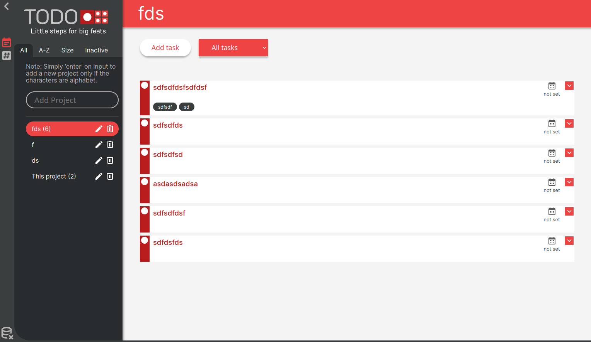

# Todo
A to-do app that features projects and tags that are used in various cases such as organizing a set of tasks under a project or arranging tasks on classification. The project contains a task that has a property of title, description, checklists, due date, and tags. 

The design was inspired by habitica(especially the task modal). 

### Tools used

**Pre-Development**
- Figma - to visualize initial design
- Obsidian - for preparation, mostly for pseudocode, otherwise it is used to list all of the required factory functions or objects, todos, files, tools and other related concepts.

**Development**
- Webpack

**Third-Party Libraries**
- Material Icons
- Sweet Alert
- Date-fns

### Screenshot

